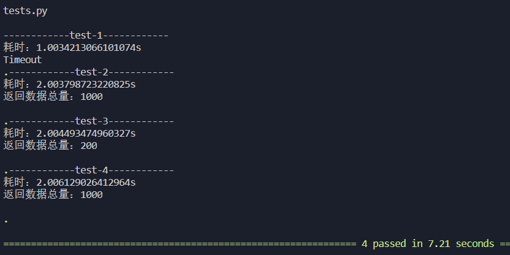
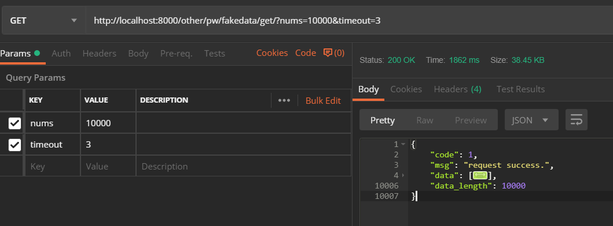

# 任务并行 ParallelTask

### 运行环境
1. Python >= 3.6
2. 测试三方包：pytest

### 使用方法
1. 创建异步业务类和方法。我这里创建了 TestWorker类 和 getFakeData 方法来表示具体业务，注意该方法必须是异步方法。

2. 创建 ParallelTask 实例
    
        p = ParallelTask()

3. 用之前创建的业务类和方法创建一组并行任务。设置并行数量和单个协程数据量以及超时时间

        funcName = "getFakeData"
        res = p.getResult(funcName, 5, 200, TestWorker, 3)

4. 返回值为 (data, error) 元组

### 测试结果

1. 单元测试

2. webserver中测试

